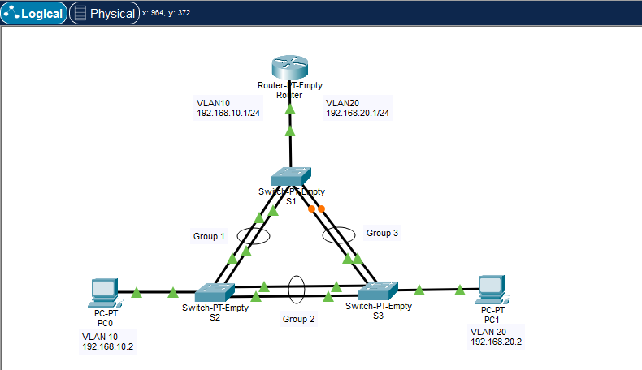
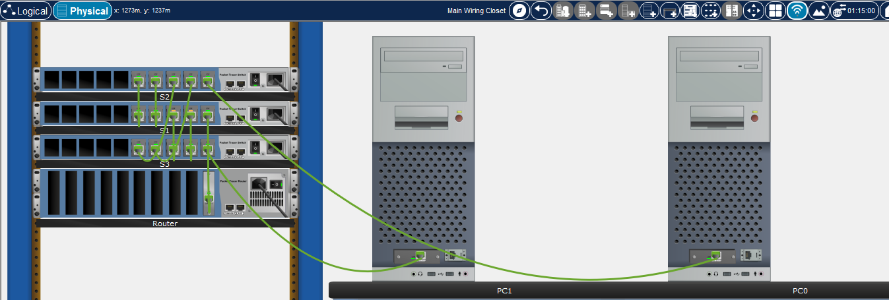

# Layer 2 EtherChannel Laboratory

This laboratory simulates a EtherChannel configuration between three Layer 2 switches, with 2 hosts and 2 vlans

**Notes:**
- Ping tests and devices configurations are located on their respective folders
- The devices have custom Ethernet modules designed to facilitate configuration and debugging
- The LACP protocol was used to configure the EtherChannels because it is an open IEEE standard (802.3ad), more widely adopted and multi-vendor, even though all devices in this lab are Cisco
- PortFast and BPDU Guard are configured on switch access ports connected to PC0 and PC1 in order to ensure rapid transition to the forwarding state while protecting the Layer 2 topology against unexpected BPDUs

  
