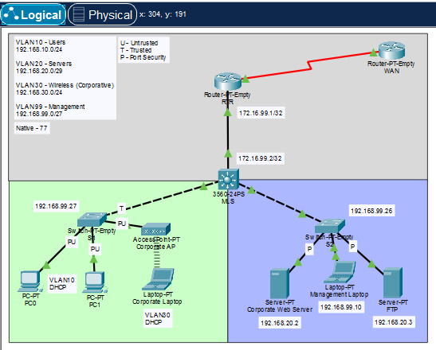
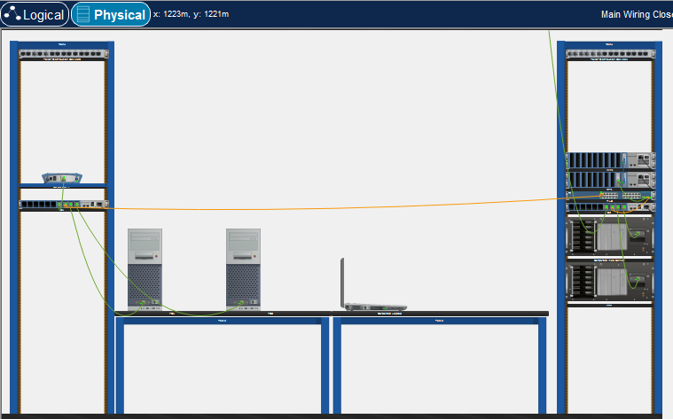
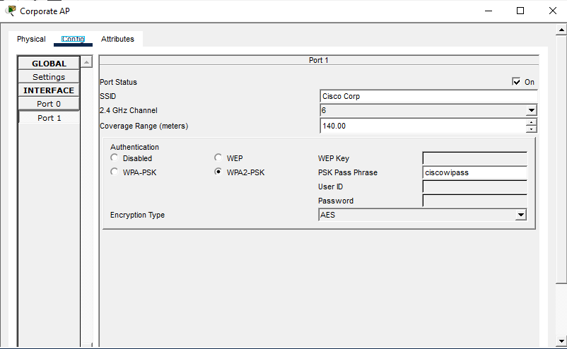

# Enterprise Campus Routing and Switching Laboratory

This laboratory simulates a small enterprise campus network integrating **Layer 3 switching, inter-VLAN routing, WAN connectivity, and access-layer security features**.  
The environment combines a multilayer switch acting as the **core/distribution layer**, access switches, edge routing, and an external WAN connection.

## Notes

- Ping tests and device configurations are located in their respective folders and files  
- Devices use custom Ethernet modules designed to facilitate configuration and debugging  
- Routers (RTR) are configured with an extended ACL that:
  - blocks unsolicited inbound traffic from the WAN  
  - blocks all ICMP echo requests, but allows ICMP replies  
- Multilayer switches (MLS) are configured with ACLs that:
  - block user access to wireless networks  
  - block user and wireless access to management networks  
  - block user access to server networks  
- Unused interfaces are assigned to a non-routable unused VLAN and are administratively shut down  
- Access ports on **S1** implement **port security, DHCP snooping, and Dynamic ARP Inspection (DAI)**  
- The wireless access point implements **WPA2-PSK authentication with AES encryption**, and its traffic is isolated using ACLs and a dedicated VLAN  
- **SSH version 2** is enabled on all managed devices  
- All virtual terminal (VTY) lines have an ACL applied that allows **only 192.168.99.0/24** to access **TCP port 22**  
- All managed devices have their virtual lines secured with **encrypted passwords**  
- The management laptop interface on **S2** is intentionally configured **without port security** to allow temporary connection of maintenance laptops during operational and troubleshooting activities  

## Purpose of the Laboratory

- Enterprise-style campus network design  
- Inter-VLAN routing using a multilayer switch  
- Secure access-layer configuration  
- Secure wireless deployment using WPA2-PSK and AES  
- Wired and wireless client integration  
- Edge routing and WAN connectivity  
- Traffic filtering and management-plane isolation

 
<br/ 
