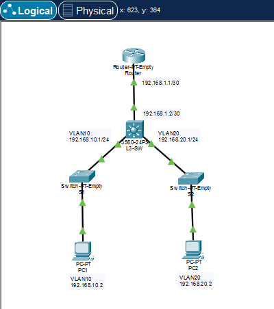
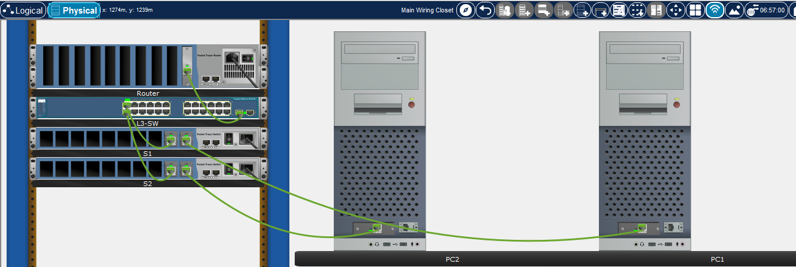

# L3 Inter-VLAN

This laboratory simulates a L3 Inter-VLAN configuration between 2 hosts using 2 VLANs

**Notes:**
- Ping tests and devices configurations are located on their respective folders
- The devices have custom Ethernet modules designed to facilitate configuration and debugging

  
