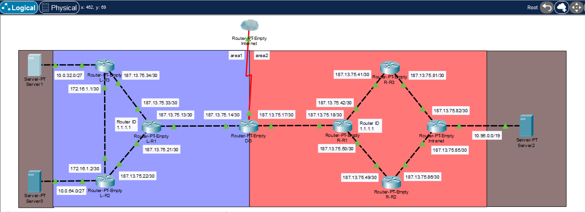
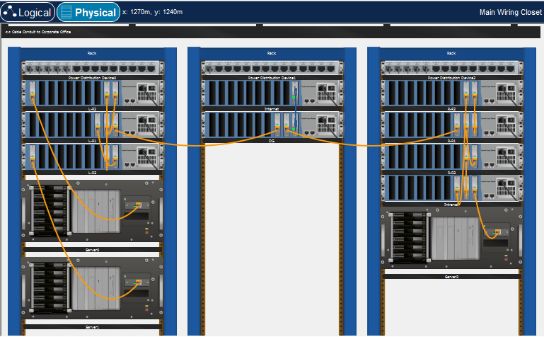

# OSPF Multi-Area Routing Laboratory

This laboratory simulates an OSPF routing environment with multiple routers organized in a hierarchical multi-area topology

The topology includes internal routers distributed across OSPF Area 1 and Area 2, a border router, and an external Internet router connected via a serial link

**Notes:**
- Ping tests and device configurations are located in their respective folders/files
- The devices have custom Ethernet modules designed to facilitate configuration and debugging
- Passive interfaces were configured on LAN-facing ports to reduce unnecessary OSPF adjacency formation and minimize CPU and bandwidth utilization
- Point-to-Point network type was explicitly configured on inter-router links to optimize adjacency establishment and eliminate DR/BDR election where not required
- The OSPF domain is hierarchically divided into Area 1 and Area 2, improving scalability and reducing LSDB size
- The OSPF border router acts as the gateway to external networks and it distribute it into the OSPF domain
- The Internet router, connected to the border router through a serial link, represents external connectivity and serves as the next hop for the default route distributed within OSPF.

  

