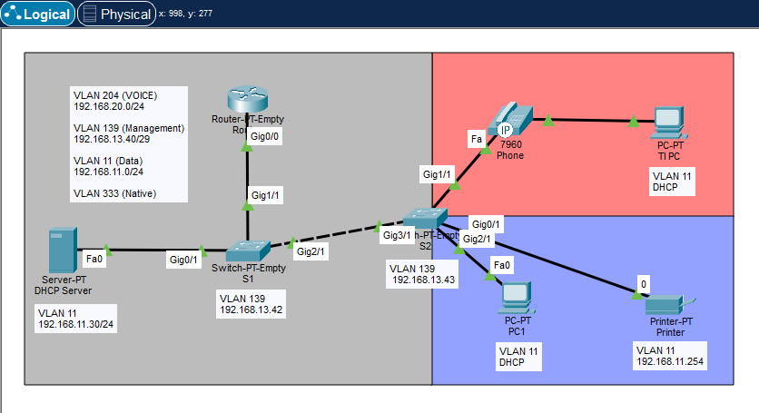
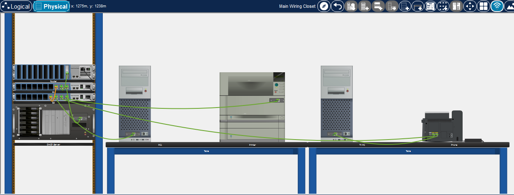

# Voice and Management VLANs Laboratory

This laboratory simulates a multi-VLAN network, using different VLANs for voice, data, and management traffic. 
Inter-VLAN routing is performed using ROAS.

**Notes:**
- Ping tests and device configurations are located in their respective folders/files
- The devices have custom Ethernet modules designed to facilitate configuration and debugging
- Switch access ports are configured with spanning-tree portfast
- Fixed IPs are configured on PCs due to a DHCP server bug that does not provide the default gateway, only IP addresses from the pool. It can be set to automatic if desired
- Since Option 150 cannot be defined by the DHCP server, there is no trunking between the S2 switch and the IP phone

  